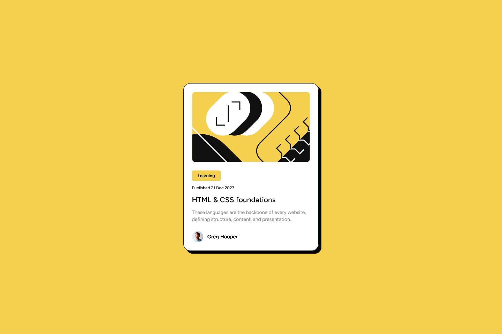

# Frontend Mentor - Blog preview card solution

This is a solution to the [Blog preview card challenge on Frontend Mentor](https://www.frontendmentor.io/challenges/blog-preview-card-ckPaj01IcS). Frontend Mentor challenges help you improve your coding skills by building realistic projects. 

## Table of contents

- [Overview](#overview)
  - [The challenge](#the-challenge)
  - [Screenshots](#screenshots)
  - [Links](#links)
- [My process](#my-process)
  - [Built with](#built-with)
  - [What I learned](#what-i-learned)
  - [Continued development](#continued-development)
  - [Useful resources](#useful-resources)
- [Author](#author)

## Overview

### The challenge

Users should be able to:

- See hover and focus states for all interactive elements on the page

### Screenshot

### Links

- Solution URL: [Source code](https://your-solution-url.com)
- Live Site URL: [Preview](https://your-live-site-url.com)

## My process

### Built with

- Semantic HTML5 markup
- CSS custom properties
- Flexbox
- Mobile-first workflow
- [Tailwind CSS](https://tailwindcss.com/) - utility-first CSS framework

### What I learned

First time using Tailwind CSS so I chose a simple project for practise. After a while I got the hand of it, so maybe I continue using it in the future more.

Other than that this project was no real challenge for me.

### Continued development

### Useful resources

- [Tailwind CSS docs](https://tailwindcss.com/) - Documentation for Tailwind CSS to look up all the needed classes

## Author

- Frontend Mentor - [@theGamingKitten](https://www.frontendmentor.io/profile/theGamingKitten)